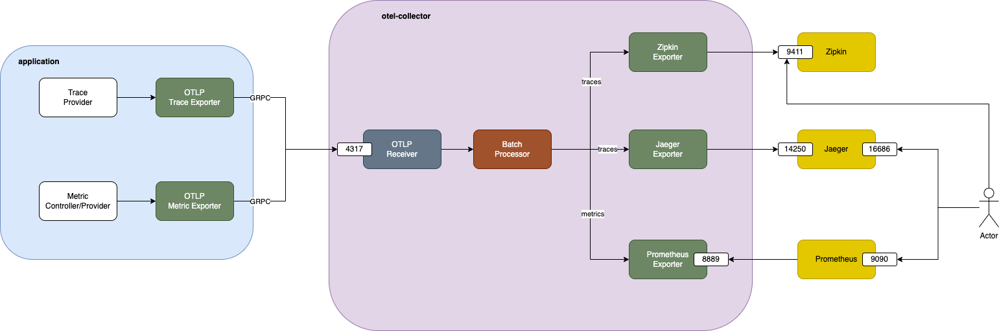

# go-otel-playground

A playground for [OpenTelemetry](https://opentelemetry.io/) using Go

## Overview



## Run

```shell
./batect run
```

This command runs jaeger, zipkin, prometheus, OpenTelemetry collector and a Go server application

Go application listens at [http://localhost:3333](http://localhost:3333) and has several endpoints:

- `/`: return fixed response
- `/manual`: use manual instrumentation to add an additional span
- `/metric`: send a metric to collector

The application uses [otelchi](https://github.com/riandyrn/otelchi) as tracing middleware for chi so all endpoints have trace enabled by default

After visiting above endpoints, you can visit following sites to check result:

- [Jaeger](http://localhost:16686/): search for traces using service name `go-otel-playground`
- [Zipkin](http://localhost:9411/): click `Run query` to show all traces
- [Prometheus](http://localhost:9090/): search for `request_counts` metric (after visiting [metric endpoint](http://localhost:3333/metric))
